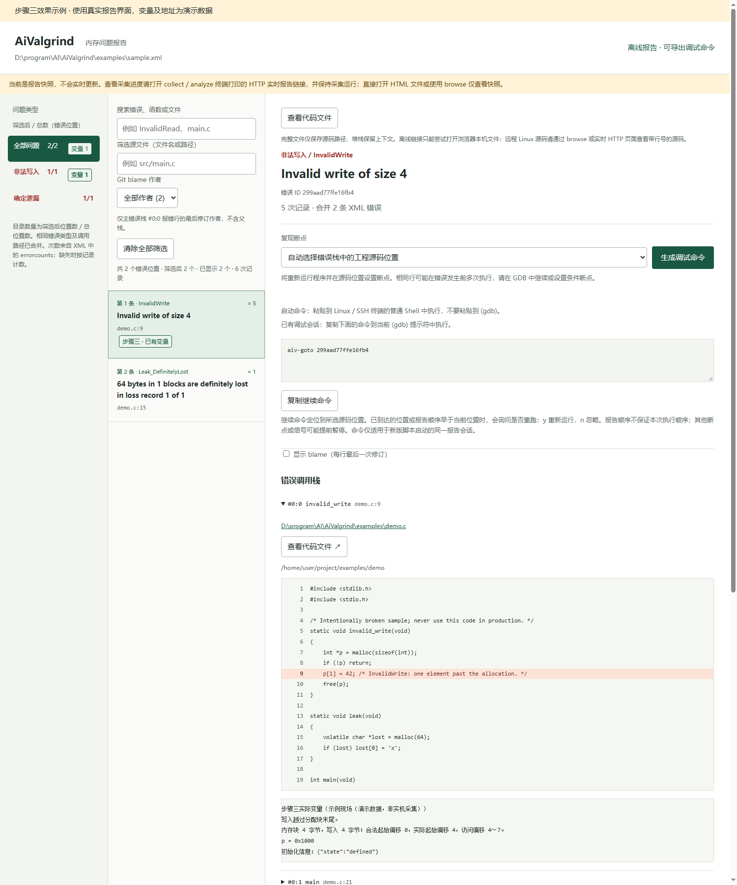

# AiValgrind

Python 库与调用示例：把 Valgrind XML 转成可离线打开的 HTML，按错误类型浏览、搜索、去重；可选工程目录，嵌入每个调用栈帧对应行的上下各 10 行源码；通过网页选中错误，在当前 Linux / SSH 终端启动 Valgrind + GDB。

复制 `inc/` 目录及入口 `main.py`、`aivalgrind.py` 到 Linux，保持相对位置。使用示例数据时再复制 `examples/`。Python 3.9 或更新版本即可，无第三方 Python 依赖。报告转换也可在 Windows 运行；联合调试需要 Linux 的 `valgrind`、`vgdb` 和 `gdb`。

兼容目标为 **Python 3.9 + GDB 10.1、10.2、13.1、15.2**。自动变量采集及 `aiv-goto` 导航要求 GDB 编译时启用 Python；固定版本 CI 分别构建这四个版本，并统一内嵌 Python 3.9。系统中运行脚本的 Python 与 GDB 内嵌的 Python 是两个独立环境，安装 Python 3.9 不会自动改变已有 GDB 的编译配置。上述版本没有 Python 扩展时可使用普通断点调试，启动时会明确提示导航不可用。

启动探测会打印实际 GDB 路径、GDB 版本和内嵌 Python 版本。如果自行构建 GDB，请在具备 Python 3.9 开发头文件及库的环境使用 `--with-python=/实际路径/python3.9`，并将构建结果的 `bin` 目录放到 PATH 前面。完整构建步骤见 `.github/workflows/test.yml` 的 `python39-gdb` 矩阵作业。每个版本独立检查 GDB 和 Python 的实际版本后运行真实 Valgrind/GDB 集成测试，一个版本失败不会取消其他版本的测试。工作流尚未执行成功时，不应将其视为已通过实机验证。

| 脚本 Python | GDB（内嵌 Python 3.9） | 验证范围 | 当前状态 |
| --- | --- | --- | --- |
| 3.9 | 10.1 | 报告、断点、导航、自动采集、进程清理 | CI 已配置，待运行 |
| 3.9 | 10.2 | 同上 | CI 已配置，待运行 |
| 3.9 | 13.1 | 同上 | CI 已配置，待运行 |
| 3.9 | 15.2 | 同上 | CI 已配置，待运行 |

## 步骤三效果图

步骤三支持源码当前行的嵌套索引分析，例如 `a[i][j]`、`obj.items[i].buffer[j]`、`a[index[k]]`。对应栈帧显示每一级的实际索引、调试类型给出的固定数组边界和越界判断，并写入现场 JSON/TXT/HTML。越界后不读取该元素；动态指针及指针成员边界未知时不自动解引用，不依据长度字段名称猜测范围。不执行函数调用、自增、自减或赋值；支持简单整数加减乘，限制分析深度和读取预算。结果是源码现场推导，不保证表达式实际执行过或就是本次错误原因；宏和跨行表达式可能无法解析。

以下截图使用真实报告界面和演示数据，不代表一次 Linux 实机采集结果。左侧类型导航显示“变量 N”，错误条目标注“步骤三 · 已有变量”；右侧对应栈帧的源码下方显示实际变量值、初始化信息，以及合法访问范围和实际越界偏移。



变量数据独立保存，采集期间只更新内容，不刷新整页。无法唯一匹配的现场不会填入历史错误堆栈。示例 HTML 可通过 `python examples/generate_step3_preview.py` 重新生成。

## 库结构与示例入口

### 自动变量采集：一次启动或分步执行

`collect` 及 `analyze` 首次检测时，在交互式终端自动显示固定状态区：开始时间（含时区）、运行时长、错误种类/位置/次数、实时网页地址，以及程序 stdout/stderr 的最新输出。状态区原地更新，不将重复统计写入终端滚动历史；终端缩放后按新尺寸显示。Ctrl+C 或正常结束时恢复原终端和光标，并打印一次最终摘要。`status.json` 保存 `started_at` 与检查点的 `elapsed_seconds`。

程序完整输出分别保存在 `program.log`（stdout）和 `launcher.log`（stderr）；屏幕仅保留最近内容，不能将它当作完整日志。Linux 采集使用独立伪终端接收 stdout/stderr，使常见程序采用终端按行缓冲，再由独立线程持续写入日志。状态区约每 0.2 秒独立刷新，不再等待 XML 解析、HTML 生成或采集间隔。程序若自行设置了缓冲、打印不带换行，仍可能需要主动 flush；Python 目标可使用 `python3.9 -u`。目标的 stdout/stderr 会识别为终端，可能影响其颜色或输出格式；stdin 仍为指定文件或空输入。这里展示的是运行时长和程序自己的进度信息，无法推断任意程序的完成百分比。脚本输出重定向或 `TERM=dumb` 时不发送终端控制码，保留日志并打印最终摘要。

Linux/SSH 交互终端采集期间，按 `q` 或 `Q` 即可退出，无需回车，`Ctrl+C` 同样有效。键盘检查间隔不超过 0.1 秒的等待片段，不受较大 `--interval` 等待时间影响；实际退出仍需完成进程清理和结果保存。终端启用中断信号并暂时关闭 Ctrl+S/Ctrl+Q 软件流控，退出时恢复原设置。两种退出方式都按中断处理（退出码 130），保存已写出的错误，不自动进入 `analyze` 的第二次运行。非交互输入不会被脚本读取。进入 GDB 后仍使用 GDB 自己的 `quit`/`q` 命令并回车。

首次收集错误时，`collect` 和不带 `--xml` 的 `analyze` 默认提供实时网页：

```bash
# 在 Linux 服务器上运行，终端会打印网页链接
python3.9 aivalgrind.py collect --output-dir run-live -p /path/to/project --port 8765 -- /path/to/program 参数

# 在本机另开终端（替换 SSH 登录地址）
ssh -N -L 8765:127.0.0.1:8765 用户名@服务器
```

本机浏览器打开 `http://127.0.0.1:8765/`，约每 2 秒同步已完整写入的错误，可筛选类型、文件和查看源码，不需要等待程序结束。运行中的次数可能只是下限；服务仅监听 Linux 本机地址，网页只读，不会启动 GDB。端口被占用时可指定其他端口，或 `--port 0` 自动分配并使用终端给出的转发命令；`--no-web` 可关闭实时网页。

正常结束或 Ctrl+C 中断后，实时服务会关闭，浏览器保留最后收到的一页；全部结果保存在 `errors.xml` 和 `results.sqlite3`。采集目录的 `report.html` 仅为轻量摘要，内含导出完整离线报告的绝对路径命令，不再实时重写完整 HTML。还可运行 `python3.9 main.py browse --xml run-live/errors.xml -p /path/to/project` 从 XML 重新提供完整网页。库调用通过 `collect_run(..., live_port=8765, project_dir=...)` 启用，省略 `live_port` 保持纯终端行为。

一次启动（无需预先生成 XML 或输入错误 ID）：

```bash
python3.9 aivalgrind.py analyze --output-dir run-all -p /path/to/project -- /path/to/program 参数
```

也可使用 `python3.9 main.py analyze` 加相同参数。脚本先检查 GDB Python 支持，再首次检测、读取错误位置，然后重新运行目标程序采集变量，保存到 `run-all/captures/session-*/`。自动分析不再等待完整 HTML 导出或 blame 查询；终端会打印独立导出命令。这是一次输入 Shell 命令、两次运行目标程序，请考虑程序写文件、请求服务等副作用。首次运行需要结束才会开始复现；长时间运行的程序可使用下面的分步方式。

分步执行：

```bash
# 1. 首次检测，Ctrl+C 可中断并保留已记录的错误
python3.9 aivalgrind.py collect --output-dir run-first -- /path/to/program 参数

# 2. 使用已有 XML（也支持被中断的 XML），自动恢复采集记录中的程序及参数
python3.9 aivalgrind.py analyze --xml run-first/errors.xml --output-dir run-values -p /path/to/project
```

两种方式都会生成 HTML，并直接进入自动变量采集，不必打开网页再选择错误。输出目录可复用，自动清理清单登记的旧结果，其他文件保持不变。已有外部 XML 缺少程序信息时，在第二条命令末尾补 `-- /path/to/program 参数`；`--cwd` 和 `--stdin-file` 可用于指定工作目录及重放标准输入。

analyze 第三步默认连续执行：自动读取并保存每个错误首次出现时的变量，保存后自动继续，重复错误不重复保存，程序结束后自动退出 GDB，无需输入 continue。采集失败、连接中断或非内存错误导致的异常停止会明确报错并结束，不会留在 GDB 等待输入。需要手动检查现场时，给 analyze 添加 `--pause-on-error`：保存后停在 `(gdb)`，输入 `continue` 继续，输入 `quit` 结束。普通 debug 和网页选择错误调试仍保留交互行为。首次报告只提供复现依据，实际暂停和保存的是新运行触发的错误，不能恢复首次运行的旧变量值。一次启动流程中按 Ctrl+C 会结束整个流程，不会自动开始第二次运行；之后可使用分步方式读取保留的 XML。公开库函数为 `inc.analyze_run(...)`，核心实现在 `inc/workflow.py`。

```text
inc/
  __init__.py    # 对外公开的库函数
  api.py         # DebugOptions、导出报告、调试及浏览接口
  core.py        # XML 解析/去重、源码匹配、进程控制、本地服务
  capture.py     # 在 GDB 内执行的自动采集及初始化分析
  processes.py   # Ctrl+C、进程组终止、超时强制结束和子进程回收
  collect.py     # 首次采集、实时类型统计、持久化检查点
  xmlstream.py   # 增量 XML 解析与截断记录恢复
  templates.py   # 离线 HTML 模板
  cli.py         # 原命令行接口实现
main.py          # 五种场景的示例调用，不包含核心实现
aivalgrind.py    # 原命令兼容入口，仅转发到 inc.cli
examples/        # C 程序及演示 XML/HTML
tests/           # 回归测试、库 API 测试和 Linux 集成测试
```

`main.py` 中五个示例函数可直接阅读、修改或复制到自己的业务代码：

```bash
# 场景一：示例 XML 转为离线报告，并打印可选错误 ID
python3 main.py report

# 首次运行，实时显示错误种类和数量；Ctrl+C 后保留数据
python3 main.py collect --output-dir run-001 -- ./your_program 参数

# 场景二：只浏览报告
python3 main.py browse --xml errors.xml -p /path/to/project

# 场景三：针对选定错误设置源码断点
python3 main.py debug --xml errors.xml -p . --error 错误ID -- ./your_program 参数

# 场景四：网页启动自动分析，采集变量/越界/初始化信息
python3 main.py auto-values --xml errors.xml -p . --capture-dir captures -- ./your_program 参数
```

在自己的 Python 工程里直接调用，无需构造命令行参数：

```python
from inc import DebugOptions, export_report, load_report, debug_error, serve_report

# 导出函数返回已去重的报告字典，便于继续处理。
report = export_report("errors.xml", "report.html", project_dir="/path/to/project")
# 也可只解析：report = load_report("errors.xml", "/path/to/project")

options = DebugOptions(
    command=["./build/app", "argument with spaces"],
    cwd="/path/to/project",
    auto_values=True,
    capture_dir="./captures",
)

# 二选一：直接调试（使用报告中的真实错误 ID），或开启网页服务。
# exit_code = debug_error(report, "真实错误ID", options)
serve_report(report, options=options, port=8765)
```

公开接口为 `DebugOptions`、`load_report`、`render_html`、`export_report`、`debug_error`、`serve_report`、`collect_run`。库函数失败时抛出异常，不会调用 `sys.exit`；仅导入库不会启动服务或进程。`debug_error` 返回 GDB 退出码；`serve_report` 会阻塞到 Ctrl+C，应在主线程中调用。调试需要 Linux；analyze 默认自动运行，也支持无交互终端。手动调试及 `--pause-on-error` 需要交互终端；不传 `options` 的 `serve_report(report)` 只提供浏览。

`browse` 启动后，请保留提供网页服务的 SSH 终端。在网页选中错误，点击“生成调试命令”并复制；另开一个连接同一台 Linux 服务器的 SSH 终端，把完整命令粘贴到普通 Shell 中执行。等出现 `(gdb)` 后，才可以输入 `bt`（调用栈）、`info locals`（局部变量）、`print 变量名`（替换为实际变量）、`continue`（继续）或 `quit`（结束本次调试）。网页的“复制继续命令”得到的 `aiv-goto …` 也必须粘贴到已有会话的 `(gdb)` 中，不能在 Shell 中执行。`browse` 只提供网页服务；需要保存离线 HTML 请使用 `report`。

以下原有 `aivalgrind.py` 命令保持兼容。

## 首次采集、实时统计与中断后继续分析

```bash
# 首次运行不需要预先生成 XML，也不依赖 GDB
python3 aivalgrind.py collect --output-dir run-001 --interval 1 -- ./your_program 参数

# 可以中途 Ctrl+C。随后独立查看统计或生成 HTML
python3 aivalgrind.py summary run-001/errors.xml
python3 aivalgrind.py report run-001/errors.xml -p /path/to/project -o partial-report.html

# 即使 XML 被截断，也能选择其中已完整写出的错误重新运行、自动分析
python3 aivalgrind.py serve run-001/errors.xml -p /path/to/project \
  --auto-values --capture-dir captures -- ./your_program 参数
```

运行中增量读取已落盘 XML，默认每秒检查一次；统计变化时实时打印错误类型、去重位置数和次数。Valgrind 通常仅输出每个错误上下文的首次记录，重复次数在 `errorcounts` 中另行汇总。因此缺失最终计数时明确显示“至少 N 次”，**不把它冒充精确的重复发生总次数**；错误发现到显示的延迟还取决于 Valgrind 何时输出 XML。

采集目录允许已存在。脚本使用 `.aivalgrind-files.json` 登记自己生成的文件，重跑时只清理这些旧输出（含登记的变量快照），不递归删除目录，保留用户的其他文件和子目录；作为本次分析输入的 XML、程序及标准输入文件也受保护。没有清单的旧版本输出不会按文件名猜测归属；同名冲突、损坏清单或链接会报错并停止，请另选目录或自行整理旧输出。不要手动修改清单，也不要让两个采集任务同时使用同一结果目录。

输出文件包括 `errors.xml`（原始结果）、`status.json`（原子替换的最新统计和 running/finished/interrupted/failed 状态）、`program.log`（目标程序标准输出）、`launcher.log`（标准错误）和 `valgrind.log`（Valgrind 文本日志，如有）。Ctrl+C 后先清理并回收进程，再读取最后写出的 XML 并保存统计。`collect` 支持 `--cwd` 和 `--stdin-file`；默认目标标准输入为空。

库调用：`collect_run(["./app", "arg"], "run-001", cwd="/project", interval=1)`。仅需报告处理时，`load_report`、`export_report`、`debug_error` 和 `serve_report` 也兼容不完整报告。

恢复规则：保留完整的 `<error>` 和已闭合的计数 `<pair>`，丢弃末尾未写完的错误；不会猜补缺失栈帧。完整记录的错误 ID 与正常结束报告一致。非截断造成的 XML 结构损坏仍会报错；没有任何完整错误时可以生成空报告，但无法选择不存在的错误调试。过早中断、尚未输出根节点时需重新采集。

报告会标记不完整。被中断运行可能没有退出时的泄漏检查，缺失的错误和历史变量值无法恢复。自动分析是重新执行，仍取决于错误能否复现；不会把已保存的部分 XML 当作历史内存快照。需要严格验证时使用 `--strict-xml`，库函数使用 `load_report(path, allow_partial=False)`。

## 1. 先自行生成 XML

保留与报告对应的程序、动态库、源码、参数和输入。使用调试符号、低优化级别编译更容易定位：

```bash
gcc -g -O0 examples/demo.c -o examples/demo
valgrind --tool=memcheck --xml=yes --xml-file=errors.xml \
  --leak-check=full --show-leak-kinds=all --track-origins=yes \
  ./examples/demo
```

`examples/demo.c` 故意包含越界写和泄漏，供验证使用。实际使用时替换成自己的程序。正常结束可获取更完整的计数和泄漏结果；中断时也可以恢复已完整写出的记录。对 fork/多进程程序，使用 `--xml-file=errors.%p.xml`，每个进程的 XML 分别处理。内置 `collect` 面向单个主程序；多进程共享一个 XML 可能交错损坏，应手动分进程采集。

## 2. 生成离线 HTML

```bash
python3 aivalgrind.py report errors.xml -o report.html

# 加入工程根目录后，报告包含源码上下各 10 行，错误行高亮
python3 aivalgrind.py report errors.xml \
  --project-dir /home/user/project -o report.html
```

把 `report.html` 下载到本机，直接用浏览器打开。报告的样式、数据和脚本全部内嵌，不依赖 CDN 或外部文件。指定工程目录后源码也会包含在 HTML 内，分享报告时请注意这一点。

左侧导航按类型筛选，中间列表支持搜索错误、函数和路径，右侧显示完整调用栈及源码。每条错误有稳定 ID。点击“生成调试命令”，命令自动使用 Python、脚本、XML、工程目录和目标程序的绝对路径，带入生成报告时提供的工程目录，以及 XML 记录的原程序参数，无需重新填写。

“筛选源文件”支持文件名、完整路径或部分路径，并统一识别 `/` 和 `\`。类型、关键词和源文件筛选同时生效；列表明确显示总位置数、筛选结果数和已显示数，点击“清除全部筛选”恢复全部结果。大报告先显示 100 条，可继续加载；折叠的源码在展开时加载。启动命令仅在参数包含空格或特殊字符时加双引号并转义，请保留必要引号，在 Linux Shell 中执行；`aiv-goto` 继续命令则在 `(gdb)` 中执行。

实时页面与离线报告共用去重规则：相同类型、相同访问长度及完整调用路径的错误，忽略关联描述中的具体地址、块大小和块内/边界偏移数值，只保留第一次现场并累计次数。越界方向、分配/释放状态、关联调用栈或未初始化来源不同仍分别保留；仅列表标题或第一帧相同不代表同一问题。没有可靠源码位置时保留指令地址区分，避免误合并。此规则调整后，相关错误 ID 可能变化，请重新生成报告并使用新 ID。

请在实际调试的 Linux 主机上生成报告，浏览器可以在另一台电脑打开 HTML；命令中的绝对路径属于生成报告的主机。`collect` 会在采集目录保存 `run.json`，报告优先使用其中记录的程序、参数、工作目录和标准输入文件，中断后也保留这些信息。外部 XML 没有工作目录时，默认使用工程目录（未提供则使用 XML 所在目录），报告会提示该假设。XML 和采集记录均没有程序信息时，会明确提示无法生成完整命令，不再提供需要手动替换的示例程序。已有 HTML 需要重新生成才能应用此功能。

已在调试某条错误时，可在网页选中另一条错误，点击“复制继续命令”，粘贴到当前 SSH 终端的 `(gdb)` 提示符：

```text
aiv-goto 错误ID
aiv-goto 错误ID 0:0
```

此命令需要支持 Python 的 GDB，以及新版脚本启动的同一报告会话。它在当前进程设置所选源码断点并继续执行，不需要重新输入工程目录或程序参数。导航会跟踪已到达的报告位置；目标已到达、报告序号早于当前位置或程序已结束时，提示是否重新运行。输入 `y` 后，启动脚本先清理旧进程，再用原参数、工作目录和标准输入文件启动新的 Valgrind/GDB 会话；输入 `n`（或其他非 y 输入）则保留当前现场。重跑不会保留手动添加的 GDB 断点和设置。普通 GDB `continue` 仍可使用。

这里的序号是 XML 中去重错误首次出现的顺序，不是浏览器筛选后的序号，也不保证多线程或不同输入下的实际发生顺序。导航定位的是源码位置，可能在真正出错之前命中，同一源码位置也可能对应多条错误；泄漏定位到分配位置。其他用户断点、信号或自动采集的内存错误可能提前暂停，此时可再次执行继续命令。程序退出仍未到达目标会给出提示，不会声称已复现该错误。

## 3. SSH 环境：网页选择错误并启动 GDB

若终端报 `Python scripting is not supported in this copy of GDB`，说明当前 GDB 没有编译 Python 扩展支持；仅安装 Python 或 pip 包不能解决。可在服务器运行 `command -v gdb` 和 `gdb -q -nx -nh -batch -ex "python import gdb; print('Python OK')"` 确认所用版本。普通调试会自动禁用 `aiv-goto` 并保留源码断点、`bt`、`info locals`、`print` 和 `continue`；切换错误时先 `quit`，再执行另一条错误的完整启动命令。`--auto-values` 必须更换为带 Python 支持的 GDB（确保 PATH 优先找到它），或移除此选项使用普通调试。GDB 的构建选项见 [官方 Python 支持说明](https://www.sourceware.org/gdb/current/onlinedocs/gdb.html/Python.html)。

在本机建立 SSH 端口转发并登录 Linux，远程和本地端口请保持一致：

```bash
ssh -L 8765:127.0.0.1:8765 user@linux-host
```

在这个 SSH 终端中启动服务，`--` 后面是实际程序及参数：

```bash
cd /home/user/project
python3 aivalgrind.py serve errors.xml --project-dir . \
  --port 8765 -- ./build/your_program argument1 argument2
```

本机浏览器打开 <http://127.0.0.1:8765>，选中错误，点击“在终端启动 GDB”，然后切回这个 SSH 终端：

1. 脚本重新启动程序，Valgrind 用 `--vgdb-error=0` 在启动时等待连接。
2. GDB 通过独立的 vgdb 管道和指定 PID 连接这次运行。
3. 自动优先选择主错误调用栈中工程源码的位置，设置断点并 `continue`。网页下拉框也可指定其他帧。
4. 在 GDB 中检查现场；执行 `quit` 后本次目标进程会清理，网页可选择下一条错误。任何阶段按 Ctrl+C 都会结束整个当前调试/服务，不再只是暂停 GDB。

```gdb
bt
info locals
print variable_name
next
continue
monitor v.info last_error
monitor leak_check full reachable any
quit
```

也可不传程序，只浏览报告：

```bash
python3 aivalgrind.py serve errors.xml --project-dir . --port 8765
```

服务仅监听 `127.0.0.1`，不直接公开到网络；调试接口校验 Origin、Host 和会话令牌，不接受网页提供的任意程序或命令。同一时间只允许一个调试会话。请通过上面的 `127.0.0.1` 地址访问，而不是 `localhost`；改端口时同步修改 SSH 转发两端和 `--port`。

## 4. 直接按错误 ID 调试

```bash
python3 aivalgrind.py debug errors.xml \
  --project-dir /home/user/project \
  --error 报告中显示的错误ID \
  --cwd /home/user/project \
  -- ./build/your_program argument1

# 指定第二个调用栈中的第一个帧；下标从 0 开始
python3 aivalgrind.py debug errors.xml --error 错误ID \
  --frame 1:0 -- ./build/your_program
```

`--cwd` 控制程序和 GDB 的工作目录，默认当前目录；`--project-dir` 只影响源码解析。程序继承启动脚本时的环境变量。

需要标准输入时，用 `--stdin-file input.txt` 重放输入。默认目标程序标准输入为 `/dev/null`，SSH 终端输入留给 GDB，不支持目标程序与 GDB 共用交互式 stdin。

如希望除了源码断点外，也在新运行中 Valgrind 检测到的每个错误处停下，加入 `--stop-on-error`：

```bash
python3 aivalgrind.py serve errors.xml -p . --stop-on-error \
  --stdin-file input.txt -- ./build/your_program
```

所有脚本选项放在 `--` 之前，目标程序及其选项放在之后。不会自动执行 XML 中记录的命令。

## 5. 自动提取错误发生时的变量值

在 `serve` 或 `debug` 后加入 `--auto-values`：

```bash
python3 aivalgrind.py serve errors.xml -p /home/user/project \
  --auto-values --capture-dir ./captures -- ./build/your_program argument1

python3 aivalgrind.py debug errors.xml -p . --error 错误ID \
  --auto-values --capture-dir ./captures -- ./build/your_program
```

此模式需要带 Python 支持的 GDB。它自动启用 Valgrind 错误暂停，跳过原来的源码断点，直接运行到实际内存错误，然后自动采集：

- 当前停止线程的调用栈、参数和局部变量（最多 16 帧，每帧 128 个变量）。
- 变量类型、可观察值，以及“已优化”或“不可读取”的原因；不调用目标程序函数。
- 自动查询 Valgrind 的初始化有效性位，标注已初始化、未初始化、部分未初始化、不可访问或无法检查；当前值为 0 不代表已经初始化。
- Valgrind 原始错误、访问地址和访问大小，以及可获得的分配/释放位置。
- 当 Valgrind 给出内存块边界时，解释块首/块尾越界或访问已释放内存；无法确定数组下标或期望值时不猜测。

同一会话内，相同错误诊断和调用路径只保存第一次现场及变量值。去重忽略十六进制地址、进程及线程编号，保留错误类型、访问大小和各调用位置；不同调用路径仍分别保存。后续重复错误不覆盖原文件、不再次打印变量。在 debug / serve 的交互模式或 analyze --pause-on-error 中，它们仍可能让 GDB 暂停，使用 `continue` 继续；analyze 默认会自动继续，不等待输入。

每次调试创建独立会话目录：

```text
captures/session-xxxxxxxx/
  capture.py          # 自动生成的 GDB 采集器
  error-0001.html     # 可下载到本机直接打开的现场报告
  error-0001.json     # 结构化变量与诊断
  error-0001.txt      # 文本现场
  error-0002.*        # 若遇到其他不同问题
  valgrind.log       # 退出调试时保存的原始日志
```

文件序号代表本次会话中首次遇到的不同问题，不是历史 XML 的错误编号。报告中的 `requested_error_id` 仅记录用户选择，**不表示本次捕获错误已与历史错误匹配**。泄漏在退出时检测，分配函数的局部变量往往已经不存在，不能据此恢复分配时的值。未初始化变量即使显示了某个数值，也不代表它是有效的业务数据。

### 未初始化成员的错误与警告

初始化检查随 `--auto-values` 自动启用，不需额外参数。结构体按调试符号中的成员布局检查，排除成员之间及末尾的填充字节，并在报告中给出如 `item.unused`、`items[2].count` 的成员路径及未初始化字节偏移。

- **错误事件**：Valgrind 已报告使用未初始化值（例如条件判断依赖未初始化数据），仍保留为错误。
- **成员警告**：额外扫描发现成员未初始化，但没有本次实际使用的直接证据，只给警告；不会因为同一结构体出现错误，就把其所有未初始化成员判成错误。
- **成员地址关联错误**：系统调用报告明确给出未初始化字节地址，且该地址落入某成员的未初始化字节范围，才将该成员标注为错误，并记录地址关联证据。

“没有使用证据”不等于“整个运行中从未使用”。普通未初始化条件判断通常不提供操作数地址，因此可能同时看到一条真实错误和若干成员警告；这比猜测某个成员就是根因更可靠。复制未初始化数据本身不一定触发 Memcheck 错误。只在现有错误暂停点进行扫描，不会为完全无报错的执行额外插入检查点。

每个变量最多检查前 256 字节，每次现场最多 256 次查询和 32768 字节。超限仅标记部分检查，绝不据此前缀判断整个变量已初始化。指针仅检查指针自身，不遍历指向的堆内存；寄存器变量、联合体活动成员、位域、浮点布局和缺失符号等会明确标为无法或部分检查。相关原始有效性位保存于 JSON 的 `initialization.raw_vbits`，成员警告/错误位于 `initialization_analysis.findings`。

网页会显示自动采集模式；点击“启动并采集变量”后，在 SSH 终端查看输出路径。现场报告不会自动合并回历史 XML 报告。每个值最多保存 4096 字符，长数组限制显示元素数量；快照可能包含程序运行数据，分享前请检查内容。

## 去重与源码匹配规则

- 按错误类型、归一化错误描述和所有调用栈（包括分配、释放、未初始化来源栈）分组；描述中的十六进制地址不参与去重。有文件和行号的帧不使用运行时绝对地址。
- 类型、源码行、调用者或来源栈不同的错误保留为不同条目；没有行号的帧保留地址，避免把同一函数内不同位置误合并。缺失符号时，不能保证跨地址变化去重。
- 优先使用 `errorcounts` 计数，缺失时一条 XML 错误记为一次。相同 `unique` 只计一次，合并不同 `unique` 的次数相加。泄漏字节/块数单独相加，不再乘出现次数；它们本身就是 XML 的汇总值。
- 源码匹配优先使用原路径，再尝试工程内路径后缀，最后匹配工程内唯一的同名文件。只读取工程目录内的文件；同名文件无法确定、文件缺失、行号越界时会提示。文本按 UTF-8 读取，非法字符替换显示。
- 错误 ID 由去重特征计算，因此同一份 XML 加不加工程目录都保持一致；二进制或编译路径变化后应重新生成报告。

## 复现能力与边界

XML 是诊断记录，不是进程快照。这里的联合调试是**重新运行并自动在相应源码位置设断点**，无法保证某次历史错误一定再次发生。多线程调度、输入、环境、网络状态或程序版本变化都可能影响结果。

同一源码行可能反复执行，第一次命中不一定就是发生错误的那次。可在 GDB 中使用 `condition`、`ignore` 或 `continue`，并配合 `--stop-on-error` 让 Valgrind 在实际错误处停下；该选项也会停在其他错误上，不会假定 XML 的 `unique` 是本次运行的错误编号。

泄漏记录通常给出分配路径，自动断点会停在分配附近，而不是退出时的检测现场。缺失源码位置时可退回函数断点；完全没有符号则拒绝复用旧进程绝对地址。共享库尚未加载时允许 pending 断点；如果 GDB 提示位置无法解析，请核对二进制和源码版本，必要时手动修改断点。

当前只启动并调试所提供的主程序，不自动跟踪每个子进程，不支持直接附加已有 PID。重跑时使用 Memcheck、完整泄漏检查和来源追踪，未重放原采集时所有自定义 Valgrind 选项。

## 中断、超时与进程清理

- Ctrl+C 会退出当前入口，命令行返回 130；库调用在完成清理后向调用方抛出 `KeyboardInterrupt`。Linux 上 SIGTERM、SSH 断连通常产生的 SIGHUP 也进入同一清理流程。
- GDB、Valgrind、vgdb 使用受管理的独立进程组。正常退出、启动失败、中断或异常都执行清理：先发送 SIGTERM，最多等待 2 秒，再发送 SIGKILL，最多再等待 2 秒。清理过程中重复按 Ctrl+C 不会打断回收。
- 直接子进程通过 Popen 回收；Linux 临时启用 subreaper，接收并回收同一受管理进程组内的孤儿后代，结束后恢复原设置。不使用 `waitpid(-1)`，避免抢走其他业务子进程的退出状态。subreaper 是进程级设置，库调试应放在主线程中，避免同时运行其他进程管理器。
- GDB 等待采用短超时轮询，Python 支持启动探测最多等待 5 秒，并立即打印所用 GDB 路径及启动阶段。网页连接读写有 5 秒超时，响应发送不持有状态锁；退出时关闭服务端口。GDB 修改过的终端模式在退出时恢复。
- 此清理范围覆盖保持在原进程组中的后代；目标自行调用 `setsid`/`setpgid` 脱离进程组的守护进程不在范围内。外部 SIGKILL 杀死脚本无法执行 Python 清理；内核不可中断睡眠进程也无法保证立即退出，脚本会报告清理超时而不是无限等待。

## 验证

```bash
python3 -m unittest discover -s tests -v
```

覆盖去重、计数、关联栈、源码上下文和边界、HTML 转义、路径解析、HTTP 调试接口、GDB 命令构造。在安装了 `cc`、`valgrind`、`vgdb`、`gdb` 的 Linux 上，还会自动运行真实集成测试：编译示例、采集 XML、连接 GDB、命中源码断点并继续到 Valgrind 报错。

仓库附带 Linux CI 配置。本次开发环境为 Windows，因此本地运行时真实 Linux 集成用例会跳过，需在 Linux 上执行上述命令完成验证。

实现参考：[Valgrind GDB 集成说明](https://valgrind.org/docs/manual/manual-core-adv.html)、[GDB 显式位置断点](https://sourceware.org/gdb/current/onlinedocs/gdb.html/Explicit-Locations.html)。

采集状态区还显示当前阶段（解析 XML、去重统计、生成网页、等待新增错误、保存最终结果）和本阶段耗时。`report` / `browse` 在耗时处理开始前打印提示。普通终端模式每种阶段只提示一次，避免循环刷屏。

如果仍出现终端卡住，可在 `collect` / `analyze` 添加 `--plain-terminal --output-mode file --no-web`，关闭固定状态区、伪终端和实时网页以辅助定位；程序输出仍保存在日志中，file 模式可能受到目标程序缓冲影响。采集主线程某阶段超过 15 秒没有推进时，后台尝试写入 `diagnostics.log`，记录阶段及各 Python 线程调用栈；耗时较长不一定代表死锁。该文件属于脚本输出，复用结果目录时自动清理。最终 XML 解析和报告生成允许 Ctrl+C 中断；若跳过最终保存，HTML/统计可能仍是上次检查点，可用保留的 `errors.xml` 重新生成报告。

终端固定状态区按错误类型逐行列出“去重位置数 / 发生次数”，例如 `InvalidWrite: 2 个位置 / 至少 6 次`。计数尚未完整时标注“至少”；类型过多时每 5 秒自动换页，并显示页码，保留程序输出区域。退出后的最终摘要列出所有类型。

自动变量采集（`--auto-values` 及 `analyze`）的现场 HTML、TXT、JSON 和 GDB 终端新增“同一行变量”对照：根据当前栈帧源码行，分别列出局部变量、参数以及可解析的结构体成员/常量数组元素的初始化状态。例如 `a + b * item.length` 会分别展示可读取的 `a`、`b`、`item.length`。检查依赖 Valgrind 初始化位，不以变量值是否为 0 判断。源码只读，不执行其中的表达式。

同一行出现不等于实际读取，更不等于本次错误原因（例如赋值左侧、短路分支）；普通未初始化错误仍只列候选/警告，现有系统调用错误地址与成员的关联证据单独列出。宏、多行表达式、动态下标、指针解引用、缺失源码及优化后的变量可能无法对应。检查预算或类型限制导致不完整时明确标注，结构体填充不参与判断；未出现在当前行的未初始化成员仍保留在附加警告中。建议目标程序使用 `-g -O0` 编译。

自动采集遇到 `Remote communication error`、`Target disconnected` 或 `Connection reset by peer` 时，立即停止后续变量查询，保存会话目录中的 `connection-error.txt`，由外部脚本退出并清理 GDB/Valgrind；已保存现场和首轮 XML 保留。Valgrind/目标进程提前退出时也结束自动采集等待。请同时检查该会话 `valgrind.log` 和 Valgrind 版本；断连消息本身不足以判断是否为目标退出、工具崩溃或通信问题。

报告体积优化：HTML 不再重复保存每个调用栈的源码片段，完整文件仍只保存一份，点击链接在独立页面查看；HTML 不保留无界增长的原始 unique_ids 列表，XML 和库返回数据保持完整。源码按钮移至错误详情顶部；没有完整源码时显示不可用原因。目录数量随文本/文件筛选更新，类型选项显示在该文本/文件范围内的数量，选择类型进一步过滤列表；仍可访问（Leak_StillReachable）使用同一筛选逻辑。非法写入、非法读取、确定泄漏导航保留红字。

未初始化问题去重：对有函数名但没有源码行号的栈帧按模块和函数归并，避免同一调用关系仅因指令地址不同拆分。仍区分错误类型、源码行、调用关系及来源栈；完全无符号的地址仍保留用于区分。旧 HTML 必须重新生成才能应用这些修正，哈希 ID 可能随去重规则变化。

命令行启动时按功能输出工具版本与 PATH 中实际找到的路径：`report`、`summary` 和只读 `browse`/`serve` 显示当前 Python；`collect` 增加 Valgrind；`analyze`、`debug`、`auto-values` 及启用调试的 `serve` 增加 GDB、vgdb。每个外部版本查询最多等待 3 秒，缺失、超时或不支持版本查询会明确提示，不推断工具版本。GDB 自动采集连接时另有嵌入式 Python 支持检查和版本输出；它可能不同于运行脚本的 Python。版本展示仅用于辨认环境，不代表该版本组合已通过兼容性验证。

实时固定状态区会持续显示当前任务（`collect`，或 `analyze` 的第 1/3 步）、启动时检测到的工具版本及所需能力，避免进入实时界面后看不到启动环境。`已运行` 为本次采集总时长；`本阶段耗时` 改为同名步骤多次执行的累计秒数，等待/解析循环不会每轮归零。后续自动分析步骤继续使用原有步骤提示及 GDB 环境输出。


源码外置：`report.html` 配套 `report.html.sources/`，报告内不再保存完整源码或上下文片段。错误调用栈旁的源码绝对路径为可点击链接，新标签页打开独立源码页面并定位错误行，使用类似 GitHub 的行号及基础配色。实时服务的源码路径为 `/source/<文件ID>.html`，仅提供本次报告已解析的工程文件，不允许任意路径读取。复制离线报告时请保留报告与配套目录的相对位置。库函数 `render_html` 仅生成报告字符串（默认链接到服务源码路由），导出离线文件请使用 `export_report`。


源码查看只保存绝对路径，不复制源码、不生成 `.sources` 目录，也不把源码内容写入报告。通过 `browse` 或实时 HTTP 网页点击路径时，服务读取当前工程文件，在新标签页提供类似 GitHub 的行号、配色和错误行定位；源码移动或删除会提示不可读取。离线 HTML 的文件链接只能尝试打开浏览器本机文件，不能读取远程 Linux 文件，也不提供同样的排版；远程查看请使用 SSH 转发后的 HTTP 网页。源码发生修改时显示当前内容，不是错误发生时的快照。

版本栏明确区分“当前检测版本”和版本要求：Python 3.9 及以上；Valgrind 3.9.0 是现有启动参数的最低版本（3.8.x 不兼容），不代表所有较新版本组合均已验证；GDB 适配目标为 10.1、10.2、13.1、15.2，自动变量采集还需该 GDB 编译时包含 Python 支持。上述具体版本号在启动输出和固定状态区中持续显示。

堆栈源码恢复上下各 10 行上下文并默认显示 blame：每行列出最后一次修订的提交短号、作者和日期（UTC），悬停查看完整提交号和说明。取消“显示 blame”勾选只隐藏修订信息，源码仍显示。完整文件仍只保存路径，点击 HTTP 链接时读取。
没有 Git、非 Git 工程、未跟踪文件、失败或超时均降级为“无 blame 信息”，不影响报告生成。通过 `git blame -L 起始行,结束行` 仅查询堆栈展示的上下各 10 行；相同范围在一次报告内只查一次，已覆盖的范围可复用缓存。单次查询最多 30 秒，各范围独立限时，不再共享会导致后续文件被跳过的总预算。成功结果缓存最多 60 秒，源码修改后重新查询；失败结果不跨报告缓存。Blame 表示每行最后一次归属，不是完整修改历史。
实时采集使用 Python 标准库 SQLite，完整 XML 错误只处理一次，批量提交；`errorcounts` 只修正对应错误的累计次数。历史错误不再累积在内存 XML 树中。数据库使用 WAL，相关文件列入脚本输出清单，复用目录时仅清理已登记输出。
实时网页每页最多 100 条，仅查询当前页；选择错误后再获取调用栈。独立后台任务逐条查询最内层报错行的作者，选中的错误优先加载完整源码上下文。作者筛选中的“无作者信息”包含尚未查询完成的记录，页面会提示待查询数量；仍可访问不计入作者数量。可读取源码但报错行 blame 缺失时，后台间隔 15 秒重试，总计最多 3 次。完整片段及 blame 不阻塞采集主循环。停止采集时取消后台查询，收尾仅保存摘要，不查询源码。
完整离线 HTML 可通过 `report` 命令生成，包含上下文和 blame；重复源码片段共用数据，减少文件大小。短 Git 查询完成即继续，不再固定等待 0.1 秒；单次超时 30 秒。以上优化不关闭未初始化来源追踪、泄漏检测或其他现有检测项，Valgrind 插桩本身的运行开销仍然存在。
完整报告导出默认使用 4 个线程查询源码/blame，可用 `python3 aivalgrind.py report errors.xml -p /path/to/project -o report.html --workers 4` 指定 1–8 个线程；库函数 `export_report(..., workers=4)` 同样支持。解析、去重、源码/blame、HTML 保存分别显示进度及耗时；交互终端每秒原地更新一行，按中文显示宽度限制长度，避免自动换行；重定向日志仅记录开始和结束状态，不周期性追加进度。Ctrl+C 取消尚未执行的任务，并通知正在等待 Git 的线程清理退出。
`analyze` 步骤 2 自动生成结果目录中的完整 `report.html`，完成后打印绝对路径，可直接用浏览器打开，无需另行执行导出命令。复用本次采集的 SQLite 错误位置；提供工程目录时使用 4 个线程加载堆栈源码上下文和 blame，显示处理帧数、阶段及耗时。报告写入完成后才进入步骤 3 的 GDB 变量采集；Ctrl+C 中断报告生成时不会启动复现。独立使用 `collect` 后仍可通过 `report` 导出完整离线报告。
实时页面仅在数据变化时重建对应列表、类型目录和作者选项，选择作者时不刷新正在操作的下拉框；取消过时请求，隐藏标签页暂停轮询。源码先显示，blame 随后补充；详情请求超时或断连保留已显示内容，并提供重试按钮。后台复用工程文件索引及有限源码缓存，数据库暂时锁定时重试。类型/作者统计由数据库增量维护，普通刷新不再全表分组；关键词和文件子串筛选仍需要查询匹配记录。升级后请重启采集并刷新 HTTP 页面，让新的数据库结构和页面脚本生效。
问题筛选支持 Git blame 作者：只取主错误栈最内层帧（#0:0）实际报错行的最后修订作者，不计入上下文行、父栈或其他来源栈。缺失时归为“无作者信息”，不会向父栈回退。作者筛选可与关键词、文件和问题类型组合使用，目录数量同步显示筛选后 / 总数；实时更新保留当前筛选并补充新作者。隐藏 blame 注释不影响作者筛选。

步骤三变量通过独立数据文件加载，显示在匹配错误的主调用栈帧下方。匹配要求实际错误描述、源码路径、行号和采集范围内的主调用栈一致且唯一；无法唯一匹配时不填入堆栈，原始现场保留在 captures 目录，状态栏显示未匹配数量。

已补充变量的错误条目显示“步骤三 · 已有变量”，已匹配现场但未能读取变量时显示“步骤三 · 未读到变量”。问题类型导航显示“变量 N”，只统计当前文件、搜索、作者筛选范围内真正取得变量的错误位置，重复现场不会重复计数。

单独执行步骤三（支持与步骤二使用同一结果目录，不清理已有文件）：

```bash
python3 /opt/GdbValgrind/aivalgrind.py analyze --step3-only --xml /data/run/errors.xml --base-report /data/run/report.html --output-dir /data/run -- /path/to/app
```

变量显示在 `full-report.html` 对应的错误堆栈中。勾选“仅显示已读出变量值的错误”，可与文件、作者、问题类型筛选组合使用；被优化掉或读取失败的变量不计入此筛选。关联依据为错误描述及按顺序对齐的源码位置，兼容无源码的系统帧、原始编译路径与本地源码映射路径；有多个候选时保留未匹配状态，避免误关联。

如果已有步骤三数据却显示“已关联 0 个错误”，更新脚本后可只升级报告的关联逻辑，无需重新采集（将以下路径换成实际安装位置和结果目录）：

```bash
python3 /opt/GdbValgrind/aivalgrind.py refresh-captures --output-dir /data/run
```

随后重新打开 `full-report.html`。此命令保留已有 `capture-updates.js` 和现场数据，仅更新报告查看功能。状态栏会区分现场数据缺失、多个候选和位置或描述不匹配；仍无法匹配时不会凭错误 ID 强行填入变量。

有配套 `run.json` 时可省略 `--` 后的程序参数。`--base-report` 默认是 XML 同目录的 `report.html`，也可指定步骤二保存的其他 HTML。步骤三沿用该 HTML，不重新查询源码或 blame；每两秒检查新现场，变化时只更新配套 `capture-updates.js`；`full-report.html` 首次接入变量查看功能后不再重写。打开页面后通过同目录的 `capture-updates.js` 每两秒增量更新现场，不刷新整页，保留筛选、展开和阅读位置；结束或中断后保存最终版并停止轮询。实时浏览需同时保留该文件，变量独立保存在 `capture-updates.js` 和 `captures/session-*` 中，查看现场时请保留配套 JS 文件。报告顶部“查看步骤三变量现场”链接可查看独立数据文件中的变量、调用栈及内存诊断，不会将所有现场错误地关联到历史第一条错误。通过 SSH 使用时，需要浏览服务器上持续更新的文件（例如静态 HTTP 服务加 SSH 转发）；提前复制到本机的文件不会同步变化。
